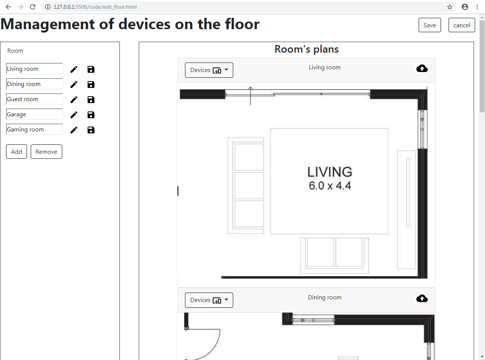

# Planimetry
On the left the user will have the various plans where by pressing the "Add" button he can add other plans.
Selecting the name of the plan and then clicking on the "pen" button allows you to change the name and then the button next to save.
By clicking on the name of the plan and then on the "Remove" button you can delete the plan.
When you make a change to the list of plans, the map also changes automatically.
At the center the user will have the 2D map of the plans.
Clicking on the "Edit" button will take you to the room editing page.
Here on the left instead of the plans you will have the various rooms of a floor with the same functionality as before.
At the center the user will find a 2D map of the rooms.
Above the maps there are several rooms and above each room on the left there is a button that makes you see the list of devices in that room.
Clicking on a device opens a screen that shows you the details of the device.
Instead on the right there is the key that allows you to load the image of the room.
Instead of the "Edit" button there are 2 more buttons.
The first "Save" to save the various changes shown in the map.
The second "Cancel" to cancel the changes made.
Both will lead to the previous page.

